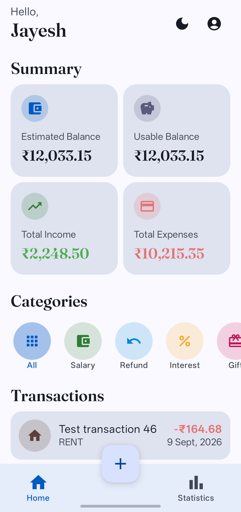
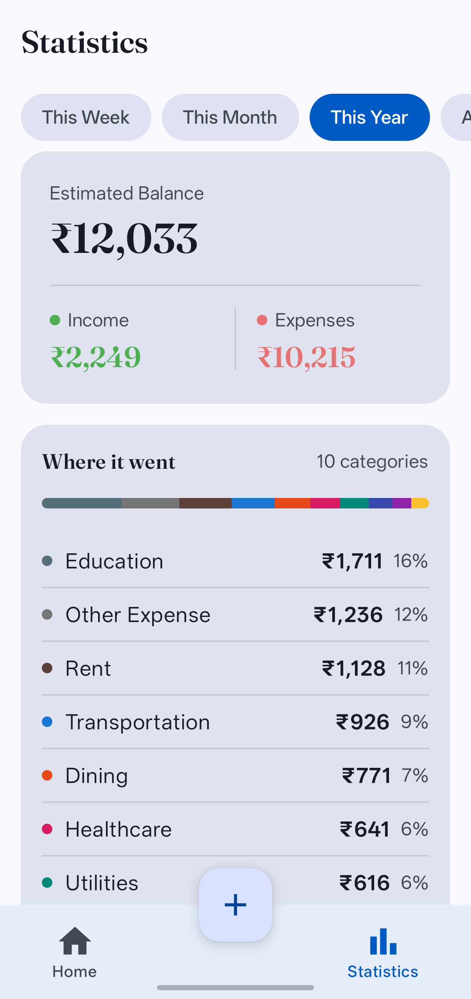
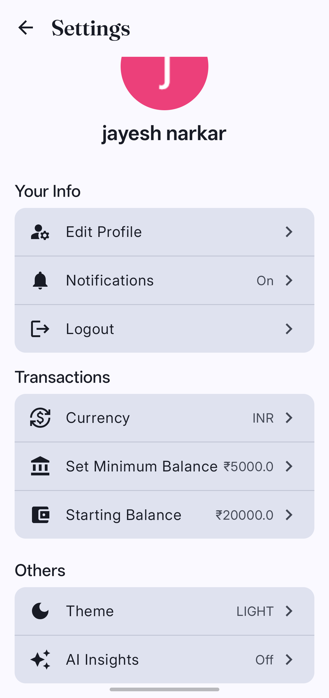
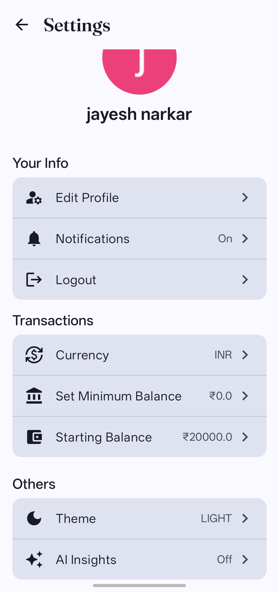
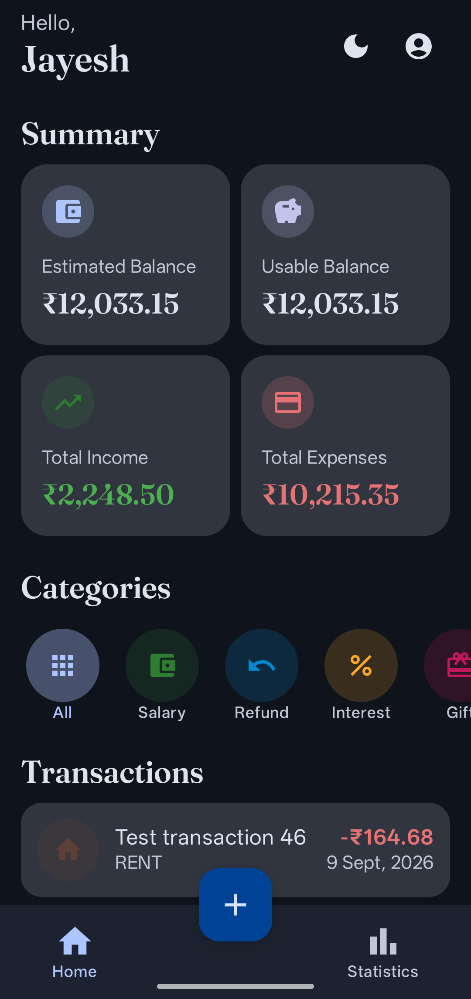
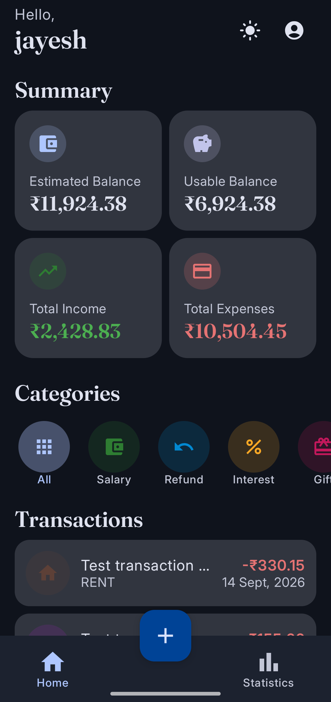
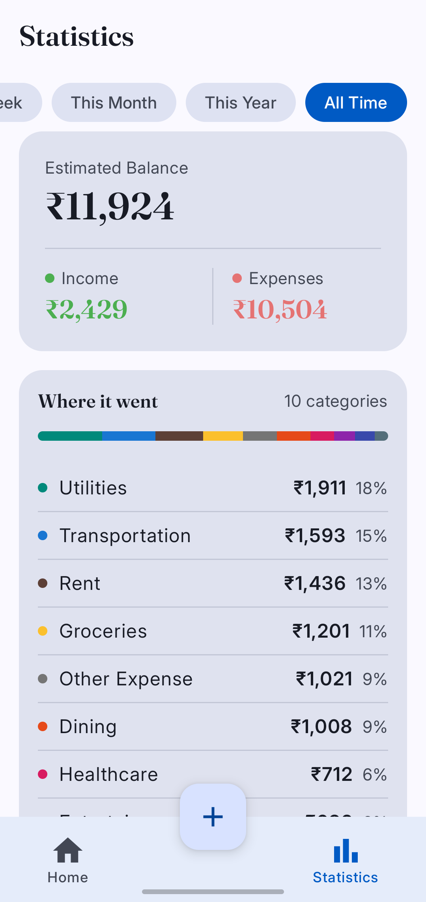
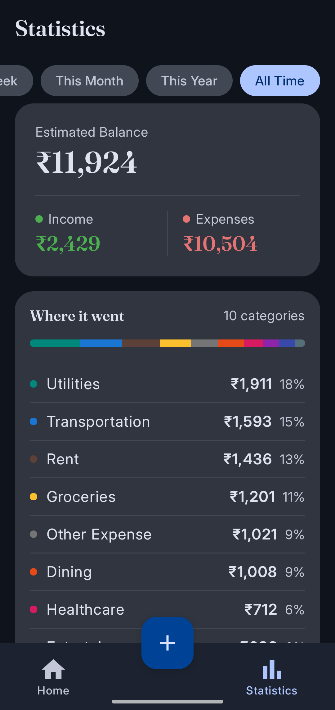

# Tijori

> **A financial memory that builds itself.**

Tijori is an Android transaction-tracking app that turns everyday bank notifications into a structured, continuously growing picture of a user's finances. When a bank sends an alert such as `50 USD debited from your account`, Tijori can recognize it, extract the important details, and record the movement automatically.

The result is a more complete financial record with less manual effort: incoming money, outgoing money, cash purchases, and transactions that never generated an alert can all live in one place.

Tijori is being built toward a more ambitious idea: personal finance software that does not merely display the past, but understands patterns, anticipates pressure, and helps people act before a problem appears.

> **Project status:** The core transaction-tracking experience is implemented. Financial analysis, forecasting, recommendations, and AI capabilities are part of the roadmap.

## Showcase

### Light Mode

| Preview 1                                     | Preview 2                                     |
| --------------------------------------------- | --------------------------------------------- |
|  |  |

| Preview 3                                     | Preview 4                                     |
| --------------------------------------------- | --------------------------------------------- |
|  |  |

### Dark Mode

| Preview 1                                    | Preview 2                                    |
| -------------------------------------------- | -------------------------------------------- |
|  |  |

| Preview 3                                    | Preview 4                                    |
| -------------------------------------------- | -------------------------------------------- |
|  |  |

## Why Tijori

Traditional expense trackers depend on perfect user discipline. Tijori starts from a different premise: financial data should be captured as close as possible to the moment it happens.

- **Automatic capture:** Supported bank SMS alerts can become transactions without repetitive data entry.
- **Complete coverage:** Debit, credit, bank, and cash transactions can be tracked together.
- **Recovery by design:** Missed alerts and offline cash activity can be added manually.
- **Built for intelligence:** A reliable transaction history creates the foundation for future analysis and forecasting.

## What Works Today

### Transaction Capture

- Parses supported bank SMS messages to identify debit and credit transactions automatically
- Extracts amounts, transaction direction, payees or payers, and UPI references
- Supports manual transaction entry for missed alerts, unregistered activity, and cash payments

### Transaction Management

- Displays a home dashboard for financial activity
- Organizes transactions by category
- Allows transactions to be reviewed, edited, categorized, or deleted
- Provides a complete, paginated transaction history
- Stores users, app settings, and transactions locally with Room

### Account and Experience

- Supports Google sign-in through Android Credential Manager
- Provides a responsive interface built with Jetpack Compose and Material 3

## Tech Stack

| Layer                 | Technologies                                                    |
| --------------------- | --------------------------------------------------------------- |
| Language and platform | Kotlin, Android SDK                                             |
| UI                    | Jetpack Compose, Material 3                                     |
| State and navigation  | Kotlin coroutines, Flow, AndroidX ViewModel, Navigation Compose |
| Persistence           | Room                                                            |
| Dependency injection  | Hilt                                                            |
| Identity              | Android Credential Manager, Google Identity                     |
| Image loading         | Coil                                                            |

## How It Works

```text
Bank SMS alert ──> SMS receiver ──> Transaction parser ──> Room database
															   │
Manual or cash entry ─────────────────────────────────────────┘
															   │
												   Compose UI + ViewModels
```

1. Users grant permission to receive and read supported bank SMS alerts.
2. A bank alert arrives for a debit or credit transaction.
3. The receiver and parser extract the amount, direction, payee or payer, and UPI reference.
4. Users can fill gaps by entering missed, unregistered, or cash transactions manually.
5. Room persists every transaction locally, while ViewModels expose the data to the Compose UI.

## Future Intelligence

The next phase moves Tijori from transaction capture toward financial understanding.

### Spending Intelligence

- [ ] Analyze spending habits for the current month
- [ ] Compare current spending patterns with previous months
- [ ] Detect unusual spending, sudden spending spikes, and anomalous transactions
- [ ] Identify recurring payments, subscriptions, bills, and other financial commitments
- [ ] Surface category-level trends and explain what is driving spending changes

### Forecasting and Planning

- [ ] Forecast whether a user will run out of money before the end of the month
- [ ] Estimate financial runway until the user's next expected salary or income
- [ ] Generate personalized budgets based on income, history, and upcoming commitments
- [ ] Recommend practical ways to reduce unnecessary spending

### AI-Powered Assistance

- [ ] Add AI-powered transaction categorization for ambiguous merchants
- [ ] Provide AI-generated financial summaries, insights, and recommendations
- [ ] Add confidence-aware forecasts that communicate uncertainty clearly

## Learning Goals

This project is also a practical exploration of:

- Building Android interfaces with Jetpack Compose
- Designing a local persistence layer with Room
- Using Hilt for dependency injection
- Managing UI state with ViewModels, coroutines, and Flow
- Receiving and parsing bank SMS messages
- Structuring a multi-screen Android application with Navigation Compose
