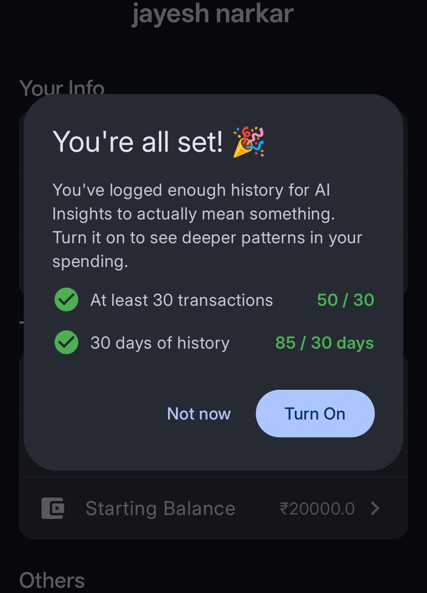
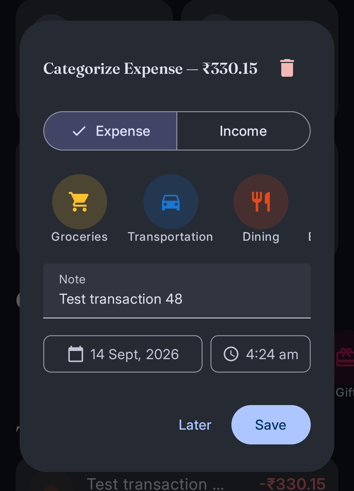

# Tijori

> **A financial memory that builds itself.**

Tijori tracks personal income and expenses on Android. It reads bank SMS automatically, categorizes transactions, and estimates your balance in real time.

## Features

**Automatic transaction capture.** Tijori parses incoming bank SMS in the background, even when the app isn't running. It extracts the amount, direction (debit or credit), and UPI reference, then flags the transaction for review. A duplicate SMS never creates a duplicate entry.

**Manual entry.** Add a transaction directly: pick a type (expense or income), a category, an amount, a date, and a time.

**Categorization.** Expenses and income use separate category sets (Groceries, Transportation, Dining, and so on for expenses; Salary, Refund, Interest, and so on for income). Each category carries a color and icon for quick visual scanning.

**Balance estimation.** Set a starting balance and a date. Tijori nets every transaction since that date against the starting figure and shows an estimated balance on Home and Statistics. Set an optional minimum balance and Tijori shows your usable balance alongside it.

**Statistics.** Filter by time frame — This Week, This Month, This Year, or All Time. Review income and expense totals, and see a category breakdown with percentages.

**AI Insights.** Once a user logs at least 30 transactions spanning 30 days, Tijori unlocks AI-generated analysis: a written summary and a short list of specific observations, computed from real spending data and sent to a lightweight Flask backend. Locked users see a blurred preview instead of empty space.

**Settings.** Manage currency, theme (light, dark, or system), starting balance, minimum balance, notifications, and AI Insights eligibility from one screen.

## Showcase

|         Home (Light)         |         Home (Dark)         |
| :--------------------------: | :-------------------------: |
|  |  |

|         Statistics (Light)         |         Statistics (Dark)         |
| :--------------------------------: | :-------------------------------: |
|  |  |

|          AI Insights          |          Add Transaction          |
| :---------------------------: | :-------------------------------: |
|  |  |

|         Settings (Light)         |         Settings (Dark)         |
| :------------------------------: | :-----------------------------: |
|  |  |

|       Insight Eligibility        |         Edit Transaction         |
| :------------------------------: | :------------------------------: |
|  |  |

## Architecture

Tijori follows a standard MVVM structure:

- **Entities** (`data/entities`) define the Room schema: `User`, `AppConfig`, `Transaction`, `InsightsCache`.
- **DAOs** (`data/dao`) hold all database queries.
- **ViewModels** (`ui/viewmodel`) expose state as `StateFlow` and `Flow`, and own all business logic. Screens never touch a DAO directly.
- **Composables** (`ui/screen`, `ui/components`) render state and forward user actions back to the ViewModel.
- **Hilt** wires every dependency — the database, DAOs, the network client, and the repository — through `@Module`-annotated providers. Nothing is a hand-rolled singleton.

### Navigation

Tijori uses Jetpack Navigation Compose with type-safe, `@Serializable` routes instead of string paths. Two navigation layers exist:

1. An outer gate in `MainActivity` chooses between the login flow and the main app, based on whether a user is currently signed in.
2. An inner `NavHost` in `MainScreen` handles the tabbed area (Home, Statistics) plus pushed screens (Settings, Add Transaction, View All Transactions).

### Data layer

Room backs every persistent store. A single `AppConfig` row holds app-wide settings. `Transaction` rows carry a `type` (`DEBIT` or `CREDIT`), one of two nullable category fields depending on that type, and a `needsReview` flag for anything Tijori parsed from SMS but hasn't yet confirmed with the user.

### SMS parsing

A manifest-registered `BroadcastReceiver` listens for `SMS_RECEIVED`, even while the app is closed. `BankSmsParser` matches known bank SMS formats with regex, extracts the amount, direction, and UPI transaction ID, and inserts a `needsReview` transaction. The UPI ID prevents duplicate entries if a bank resends the same message.

> SMS access is restricted on the Play Store to default SMS handlers. This feature targets personal or sideloaded use, not Play Store distribution, unless that changes.

### AI Insights

A small Flask service, fronted by nginx and Groq's API, accepts a compact text summary of a user's spending (current month plus three prior months, plus a few notable transactions) and returns a short JSON summary. Tijori caches the response in Room and refreshes it once every 24 hours, or immediately if the covered period changes. The client never sends raw transaction-level data — only aggregated totals and a handful of flagged amounts.

## Tech stack

- Kotlin, Jetpack Compose, Material 3
- Room (persistence), Hilt (dependency injection)
- Navigation Compose with type-safe routes
- Retrofit + OkHttp (network)
- Coil (image loading)
- Flask + Groq API (AI Insights backend)

## Project structure

```
app/
  data/
    entities/       Room entities
    dao/            Room DAOs
    database/        TijoriDatabase, Hilt DatabaseModule
    repository/      InsightsRepository
    converter/        Room TypeConverters
  di/                Hilt modules
  network/           Retrofit interface, request/response models
  sms/               BroadcastReceiver, SMS parser
  ui/
    screen/          Full-screen composables
    components/       Reusable composables
    viewmodel/         ViewModels
    navigation/        Routes and nav helpers
    theme/             Typography, color extensions
```

## Setup

1. Clone the repository and open it in Android Studio.
2. Add a Google OAuth web client ID for sign-in.
3. Point the Retrofit base URL at your own Flask deployment, or disable AI Insights.
4. Build and run. Grant SMS permissions if you want automatic transaction capture.

## Known limitations

- SMS parsing covers a narrow set of message formats and needs expansion for banks beyond the ones tested.
- Destructive migration is in place during development. Replace it with real `Migration` objects before shipping to real users with data worth keeping.
- The Flask backend has no rate limiting. Add it before exposing the endpoint beyond a single trusted client.
